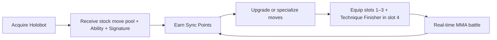

# Arena Card-to-Move Implementation Plan

Status: implementation-ready plan; no code included  
Companion document: `arena-move-system-architecture.md`  
Decision: replace collectible cards with per-Holobot move pools, Sync Point progression, fixed four-move kits, one innate Ability, Technique Finishers, and Signature Finishers.

## 1. Product contract

The target battle kit is:

Each Holobot owns a structured move pool. The pool begins with stock techniques, expands through shared/archetype/exclusive content, and records upgrades independently for that Holobot.

| Combat element | Ownership and slot rule | Runtime gate |
|---|---|---|
| Strike | Learned and upgraded per Holobot; equip in slots 1–3 | Stamina, cooldown, move requirements |
| Defend | Learned and upgraded per Holobot; equip in slots 1–3 | Stamina, reaction state, cooldown |
| Combo | Learned and upgraded per Holobot; equip in slots 1–3 | Stamina plus combo/momentum requirement |
| Technique Finisher | Learned and upgraded per Holobot; **required in slot 4** | Stamina plus combo/momentum; does not require a full Special Meter |
| Signature Finisher | Innate to the Holobot; never equipped or drawn | Exactly 100 special meter; player chooses when to fire |
| Ability | One innate Ability per Holobot; never equipped or drawn | Always active; not separately upgraded in v1 |

The battle remains real-time MMA:

- The player can use any currently legal equipped move at any time.
- AI acts independently on its existing cadence.
- Stamina still regenerates continuously and limits action frequency.
- Speed still affects combat effectiveness; it must not create Pokémon-like turn order.
- Combo, counter/reaction, and special-meter systems remain core.
- There is no deck, hand, draw, discard, duplicate-copy, or card-rarity rule.

### Non-negotiable kit invariants

1. A valid kit always contains exactly four unique move IDs.
2. Slots 1–3 accept `Strike | Defend | Combo` moves.
3. Slot 4 accepts exactly one `TechniqueFinisher`.
4. A Signature Finisher is derived from Holobot identity and cannot occupy a kit slot.
5. An Ability is derived from Holobot identity and cannot occupy a kit slot.
6. A Holobot may equip only moves in its own move pool and at or below its unlocked upgrade rank.
7. A newly acquired Holobot always has enough stock moves to form a valid kit.
8. Upgrades may improve or specialize moves, but must not bypass stamina, combo, reaction, or special-meter gates.

In player-facing terms, a **Technique Finisher is the finisher used before the Special Meter is full**. It remains available after the meter fills as well, provided its stamina and combo/momentum conditions are met; reaching 100 meter adds the separate Signature Finisher option rather than replacing or disabling slot 4.

## 2. Target player loop



The progression loop adds ownership and mastery outside battle without introducing randomness inside battle.

## 3. Move-pool structure

Each Holobot's effective pool is composed rather than authored as an isolated system:

```text
Holobot move pool
  = universal stock MMA moves
  + archetype moves
  + Holobot-exclusive moves
  + universal/archetype Technique Finishers
  + Holobot-exclusive Technique Finisher, when applicable

Innate combat identity
  = one Ability
  + one Signature Finisher
```

Recommended launch allocation per Holobot:

- 3 stock universal moves: one Strike, one Defend, one Combo.
- 1 stock archetype Technique Finisher.
- 3–5 additional universal/archetype moves unlockable for specialization.
- 1–2 Holobot-exclusive normal moves.
- 1 innate Ability.
- 1 innate Signature Finisher.

This makes every Holobot immediately playable with a legal stock kit while leaving meaningful Sync Point choices.

## 4. Move and upgrade model

### 4.1 Separate immutable move design from player progression

A base move definition describes shared combat behavior. A per-Holobot progression record describes what the player owns and selected.

```ts
type MoveCategory =
  | "strike"
  | "defend"
  | "combo"
  | "technique_finisher";

interface MoveDefinition {
  id: string;
  version: number;
  name: string;
  category: MoveCategory;
  access: "universal" | "archetype" | "exclusive";
  archetypeIds?: ArchetypeId[];
  holobotIds?: HolobotId[];
  staminaCost: number;
  basePower: number;
  speedFactor: number;
  requirements: MoveRequirement[];
  effects: MoveEffect[];
  reaction?: ReactionDefinition;
  comboTags: string[];
  animationCue: AnimationCue;
  upgradeTreeId: string;
}

interface MoveUpgradeTree {
  id: string;
  ranks: MoveRankDefinition[];
  specialization?: MoveSpecializationChoice;
}

interface MoveRankDefinition {
  rank: 0 | 1 | 2 | 3;
  syncPointCost: number;
  modifiers: MoveModifier[];
}

interface MoveSpecializationChoice {
  unlocksAtRank: 2;
  branches: [MoveSpecializationBranch, MoveSpecializationBranch];
}

interface MoveSpecializationBranch {
  id: string;
  name: string;
  description: string;
  modifiers: MoveModifier[];
}

interface HolobotMoveProgress {
  moveId: string;
  rank: 0 | 1 | 2 | 3;
  specializationId?: string;
}
```

Rank 0 is the stock move. Learning a move and upgrading it are separate concepts only where needed; stock moves begin learned at rank 0.

### 4.2 Upgrade rules

Use a shallow, predictable tree:

- Rank 0: stock behavior.
- Rank 1: small efficiency or reliability improvement.
- Rank 2: choose one of two tactical specializations.
- Rank 3: deepen the chosen specialization; never erase the move's counterplay.

Recommended specialization axes:

| Category | Branch A | Branch B |
|---|---|---|
| Strike | Pressure: faster/lower commitment | Power: more damage/meter, higher commitment |
| Defend | Safety: stronger mitigation | Counter: narrower defense, stronger punish |
| Combo | Flow: easier chain/less cost | Finish: more damage at longer chain |
| Technique Finisher | Reliable: lower combo threshold | Explosive: higher threshold and payoff |

### 4.3 Balance guardrails

- Stamina-cost reduction is capped at 1 and cannot reduce a move below cost 1.
- Speed improvements modify the move's speed factor or recovery window within bounded limits; they do not create turns.
- Technique Finishers always require at least one combo/momentum gate and stamina.
- Signature Finishers always consume 100 meter and cannot gain a cost-reduction upgrade in v1.
- Abilities and Signatures do not use the normal move upgrade tree in v1.
- No upgrade gives unconditional permanent invulnerability, guaranteed counters, infinite combo continuation, or net-positive stamina loops.
- PvP resolves the selected rank/specialization from a server-validated battle snapshot.

### 4.4 Sync Point economy

Sync Points should represent investment in a specific Holobot's techniques. The existing profile exposes account-level `syncPoints`; use it as the spendable wallet initially, while the purchased move ranks live on each `UserHolobot`.

Suggested initial costs, subject to economy tuning:

| Purchase | Cost |
|---|---:|
| Rank 1 | 25 SP |
| Rank 2 + specialization | 60 SP |
| Rank 3 | 120 SP |
| Optional specialization reset | 30 SP |

Rules:

- Spending must be authoritative and atomic: validate balance, prior rank, compatibility, branch, then debit and grant.
- A purchase is permanent across prestige.
- Respec changes specialization only; it does not refund prior rank costs by default.
- Loadout changes are free and do not consume Sync Points.
- The UI must preview exact before/after behavior before spending.
- Avoid percentage-heavy copy; show concrete values such as `Cost 3 → 2`, `Power 18 → 20`, or `Combo requirement 3 → 2`.

## 5. Innate Ability architecture

Every Holobot has exactly one Ability definition referenced by its combat definition:

```ts
interface AbilityDefinition {
  id: string;
  version: number;
  holobotId: HolobotId;
  name: string;
  description: string;
  triggers: AbilityTrigger[];
  conditions: CombatCondition[];
  effects: AbilityEffect[];
  aiHints: string[];
}

interface HolobotCombatDefinition {
  id: HolobotId;
  archetypeId: ArchetypeId;
  abilityId: string;
  signatureFinisherId: string;
  stockMoveIds: [string, string, string, string];
  movePoolIds: string[];
}
```

Ability constraints for v1:

- Always active from battle initialization.
- Visible to both players before and during battle.
- Uses shared triggers such as `battle_start`, `after_hit`, `after_defend`, `on_counter`, `on_combo`, `on_low_stamina`, or `on_special_ready`.
- Implemented through typed effects, not per-Holobot engine callbacks.
- Not equipped, drawn, purchased, ranked, or specialized.
- Strong enough to shape move selection, but not so strong that it decides the match without interaction.

Examples of healthy identities:

- First successful Strike in a chain gains bonus special meter.
- A successful counter restores one stamina once per cooldown.
- Combo moves gain a bounded speed-factor bonus while above half stamina.
- Taking a heavy hit briefly improves the next Defend move.

## 6. Two Finisher classes

### 6.1 Technique Finisher

A Technique Finisher is the capstone of the equipped move kit.

- It occupies slot 4 and is always visible.
- It consumes stamina.
- It requires combo count, momentum, an opponent state, or a combination of these.
- It does not require or consume special meter.
- It can be used while special meter is below 100; it remains independently usable at 100.
- It can be upgraded and specialized with Sync Points.
- It uses normal move cooldown/eligibility and can be anticipated/countered.
- It should end a successful pressure sequence but must not automatically end the battle.

Current combo and finisher cards should be reviewed individually: high-chain normal finishers become Technique Finishers; generic meter finishers do not.

### 6.2 Signature Finisher

A Signature Finisher is innate character identity.

- It is derived from the selected Holobot.
- It is not a loadout move and cannot be replaced.
- It becomes available at exactly 100 special meter.
- It appears as an additional combat option; it does not replace the equipped Technique Finisher.
- The meter remains full until the player chooses to use it; availability does not auto-fire.
- It consumes all 100 meter when accepted by the engine.
- It may still require the fighter to be actionable; it must not fire during an unresolved action/lock.
- It uses a dedicated UI control integrated with the special meter.
- It is not separately upgraded in v1.
- AI evaluates whether to use it now or hold it based on lethal potential, defense state, matchup, and risk.

The existing generic bonus-finisher injection must be removed. Signature availability comes from fighter identity, not hand generation.

### 6.3 Runtime command model

```ts
type BattleCommand =
  | { type: "use_kit_move"; actorId: string; slot: 1 | 2 | 3 | 4 }
  | { type: "use_signature_finisher"; actorId: string }
  | { type: "regenerate_stamina"; elapsedMs: number };
```

The engine resolves both Finisher classes through shared damage/effect/event primitives, but their eligibility policies remain distinct.

## 7. Battle-state changes

Replace card queues with a resolved kit snapshot:

```ts
interface ResolvedCombatKit {
  slots: [ResolvedMove, ResolvedMove, ResolvedMove, ResolvedTechniqueFinisher];
  ability: ResolvedAbility;
  signatureFinisher: ResolvedSignatureFinisher;
}

interface BattleFighterState {
  // Existing identity, stats, HP, stamina, speed, combo and meter remain.
  kit: ResolvedCombatKit;
  moveCooldowns: Record<string, number>;
  armedReaction: ArmedReaction | null;
  abilityRuntime: AbilityRuntimeState;
}
```

`AbilityRuntimeState` stores only bounded runtime facts such as once-per-battle use, cooldown, or last trigger sequence. It must not contain arbitrary UI state.

Remove from active state:

- player/opponent card arrays and fighter hands;
- selected card ID;
- draw/cycle positions;
- bonus-finisher card instances;
- card-copy identity where it differs from move identity.

## 8. Profile and persistence changes

Recommended fields:

```ts
interface UserHolobot {
  // existing fields
  moveProgress?: Record<string, HolobotMoveProgress>;
  combatKit?: {
    slot1: string;
    slot2: string;
    slot3: string;
    techniqueFinisherId: string;
    revision: number;
  };
  moveSystemVersion?: number;
}
```

Do not persist Ability or Signature selection because neither is selectable. Persist only their catalog version in a battle snapshot if deterministic replay is required.

Authoritative operations required:

- `upgradeHolobotMove(holobotId, moveId, expectedRank)`
- `specializeHolobotMove(holobotId, moveId, branchId)`
- `respecHolobotMove(holobotId, moveId, branchId)`
- `saveHolobotCombatKit(holobotId, kit, expectedRevision)`

Each operation validates Holobot ownership, pool compatibility, prerequisites, Sync Point balance, and optimistic revision.

## 9. Legacy card migration

### Conversion policy

1. Create a versioned `legacyCardId → baseMoveId` mapping.
2. Convert distinct owned cards to learned rank-0 moves for every currently owned Holobot when compatible.
3. Convert existing high-chain combo/finisher cards to Technique Finishers where their behavior fits.
4. Do not convert generic meter finishers into Signature Finishers; each Holobot receives its innate Signature from the Holobot catalog.
5. Collapse duplicate card copies. Convert extras into a declared compensation currency or Sync Points only after economy approval.
6. Build slots 1–3 from the first three distinct compatible non-Technique moves in saved deck order.
7. Build slot 4 from the first compatible converted Technique Finisher; otherwise assign the archetype stock Technique Finisher.
8. Fill any missing normal slots with stock Strike/Defend/Combo moves.
9. Record `moveSystemVersion` so migration is idempotent.
10. Retain legacy card/deck fields read-only for one release, then delete after migration telemetry proves coverage.

### Recommended card-category mapping

| Current card concept | New destination |
|---|---|
| Low/basic strike | Stock or learnable Strike |
| Defense card | Defend move/reaction stance |
| Short combo | Combo move |
| High-chain combo finisher | Technique Finisher |
| Generic 100-meter finisher | Retired as a card; not a Signature |
| Duplicate copy | Compensation only; never extra combat power |
| Rarity | Removed from combat; optional cosmetic provenance |

## 10. AI plan

The AI sees the same four kit slots, Ability, and Signature as a player.

Decision order:

1. Use a legal lethal normal move or Technique Finisher.
2. Use Signature if lethal or if its expected value exceeds holding it.
3. Defend/counter when predicted incoming pressure and Ability synergy justify it.
4. Continue a legal combo toward the Technique Finisher.
5. Use an efficient Strike to build combo/meter.
6. Wait briefly for stamina rather than use a strategically harmful move.

AI scoring inputs:

- expected damage and stamina efficiency;
- fighter and move speed factors;
- combo progress toward slot 4;
- opponent reaction/defense state;
- special meter and Signature opportunity;
- Ability triggers/synergy;
- current move rank/specialization;
- archetype personality weights.

Remove hard-coded move-ID decisions. AI should inspect tags, requirements, effects, and Ability hints.

## 11. UI plan

### Move Lab / Inventory

Replace the Cards tab with a Holobot-scoped `MOVE LAB`:

1. Holobot header: portrait, archetype, Sync Point balance.
2. Identity strip: Ability and Signature Finisher, both labeled `INNATE`.
3. Combat kit: slots 1–3 normal techniques; slot 4 visually labeled `TECHNIQUE FINISHER`.
4. Compatible move pool: Stock, Archetype, Exclusive, Locked filters.
5. Move detail: current rank, exact next-rank changes, specialization branches, cost, Upgrade button.

Clutter controls:

- Do not show rarity, copies, deck count, draw odds, or card art frames.
- Use category icon/color as a small accent.
- Show at most four primary stats: power, stamina, speed, requirement.
- Put full effect text and upgrade history in a detail sheet.
- When replacing slot 4, filter immediately to Technique Finishers.
- Ability and Signature have no Equip or Upgrade buttons in v1.

### Arena

- Four stable move buttons; slot 4 has a distinct Technique Finisher treatment.
- Signature control sits beside/in the special meter, not in the four-slot row.
- At 100 meter, animate readiness but do not auto-select or auto-use.
- Keep combo progress visually close to slot 4 so its requirement is legible.
- A move button shows stamina cost, cooldown, and one concise disabled reason.
- Ability is shown as a compact fighter badge with inspectable description; avoid persistent large text.
- Preserve the fast single-tap action model.

### Prebattle

Show the chosen kit, Ability, and Signature before entry payment. Invalid kits block battle start and offer a one-tap stock-kit repair.

## 12. Current-file change plan

| File/area | Planned responsibility |
|---|---|
| `src/types/arena.ts` | Introduce move categories, resolved kit, Ability, and two Finisher types; retain compatibility aliases temporarily |
| `src/types/profile.ts` | Add per-Holobot move progress, kit, and migration version |
| `src/lib/battleCards/catalog.ts` | Freeze as legacy conversion input; stop adding content |
| `src/lib/arena/card-generator.ts` | Replace with kit resolver; remove shuffle/cycle/loaner finisher |
| `src/features/arena/arenaCards.ts` | Split into move eligibility and reaction definitions |
| `src/features/arena/combatEngine.ts` | Resolve kit moves, Ability triggers, and distinct Technique/Signature gates while preserving combat math |
| `src/stores/arena-battle-store.ts` | Store resolved kits; expose `useKitMove(slot)` and `useSignatureFinisher()`; preserve timers |
| `src/config/holobots.ts` | Remove display-only special map after moving identity to combat catalog |
| `src/config/arenaConfig.ts` | Resolve Holobot kit/Ability/Signature into fighter snapshot |
| `src/screens/InventoryScreen.tsx` | Replace Cards with Move Lab and split into focused components |
| `src/components/arena/BattleArenaView.tsx` | Render four stable slots and separate Signature control |
| `src/components/arena/ActionCardHand.tsx` | Remove after move controls replace all callers |
| `src/hooks/useRealtimeArena.ts` | Remove private card pool/resolver; submit versioned kit commands to shared authority |
| `src/types/battle-room.ts` | Align room snapshots with resolved kits and move commands |
| `src/lib/arena/ai-controller.ts` | Remove duplicate implementation or replace with canonical data-driven policy |
| `src/contexts/AuthContext.tsx` | Run/idempotently request move migration; stop starter-deck grants |
| `src/lib/marketplace.ts` and Marketplace UI | Stop granting/selling battle cards; define replacement rewards |
| server callable/functions counterparts | Validate SP spending, kits, move versions, and authoritative PvP commands |

## 13. Delivery phases

### Phase 0 — Rules freeze and characterization (3–5 engineer-days)

- Write a mechanic matrix for existing stamina, speed, combo, counter, meter, and timing.
- Add characterization tests before renaming.
- Approve stock kit composition, SP costs, upgrade caps, duplicate compensation, and 12 Ability/Signature designs.

Gate: existing MMA and speed behavior has executable tests and approved numeric baselines.

### Phase 1 — Canonical content and compatibility layer (5–8 days)

- Add move, Ability, Technique Finisher, Signature Finisher, upgrade-tree, and kit definitions.
- Generate legacy-compatible resolved moves from current card templates.
- Add kit validator and stock-kit resolver.
- Snapshot content/rules versions and inject seeded randomness.

Gate: every Holobot catalog entry produces one valid stock kit, one Ability, and one Signature.

### Phase 2 — PvE runtime conversion (6–10 days)

- Replace player/opponent card arrays with four stable slots.
- Remove draw, shuffle, cycle, and generic finisher surfacing.
- Add Technique Finisher eligibility and Signature command.
- Add Ability trigger processing through shared effects.
- Adapt AI and battle events.

Gate: PvE uses no hand/deck mechanics and all preserved mechanic tests pass.

### Phase 3 — Profile migration and Sync Point progression (8–13 days)

- Add authoritative upgrade/specialize/respec/save-kit operations.
- Add versioned legacy-card conversion and fallback stock kits.
- Build Move Lab UI and pre-spend comparison.
- Add telemetry for migration, purchases, loadout validity, and move usage.

Gate: upgrades debit SP atomically; reload preserves rank/branch/kit; every migrated account has a legal kit.

### Phase 4 — Character identity content (8–14 days plus design/art)

- Define one Ability and Signature for each of 12 Holobots.
- Define archetype pools, stock Technique Finishers, exclusives, and upgrade branches.
- Balance Ability/move interactions and add animation cues.

Gate: a 12× content validation suite proves unique identity references, legal pools, bounded modifiers, and no missing assets/cues.

### Phase 5 — PvP convergence (10–18 days)

- Separate Firestore transport from rules.
- Validate submitted kits and purchased ranks on trusted authority.
- Resolve the same commands/content versions as PvE.
- Add reconnect, duplicate-command, stale-revision, and adversarial validation tests.

Gate: PvE and PvP share move definitions and resolution rules; clients cannot submit unowned ranks or incompatible moves.

### Phase 6 — Cleanup and economy retirement (4–7 days)

- Remove deprecated card types, catalogs, components, profile fields, marketplace grants, and duplicate AI.
- Replace card-facing copy/assets/products.
- Confirm migration telemetry and customer compensation completion.

Gate: repository search finds no active battle-card/deck/hand path outside migration history/tests.

Estimated engineering effort: **44–75 engineer-days**, excluding final combat balance, animation production, economy review, and live migration support.

## 14. Test and verification plan

### Domain tests

- Slot validator rejects wrong category in slot 4 and Technique Finisher in slots 1–3.
- Ability and Signature cannot be equipped or upgraded.
- Signature is unavailable below 100, remains available while held, consumes exactly 100 on use, and never auto-fires.
- Technique Finisher works below 100 meter, requires stamina and combo/momentum, and never requires or consumes special meter.
- Upgrade ranks apply exact modifiers and enforce sequential purchases.
- Specialization is mutually exclusive and respec follows policy.
- Upgrade modifiers respect stamina/speed/damage guardrails.
- Stock kit exists for all 12 Holobots.

### Regression tests

- Stamina regeneration interval and cap.
- Speed damage/effect contribution.
- Strike/combo chain behavior.
- Guard/evade/counter/perfect reversal behavior.
- Special meter generation.
- Battle end and reward settlement.
- AI cadence remains independent of player input.

### Persistence/security tests

- SP debit and rank grant are atomic and idempotent.
- Negative balance, skipped rank, invalid branch, incompatible move, and stale kit revision are rejected.
- Legacy migration runs once and always produces a valid kit.
- PvP rejects tampered ranks/content versions/kit IDs and duplicate commands.

### UI acceptance tests

- Player can inspect identity, upgrade a move, choose a branch, equip slots, and enter battle without card language.
- Slot 4 only offers Technique Finishers.
- Signature readiness is obvious at 100 meter and requires an explicit tap.
- Disabled move reasons are understandable without opening details.
- Ability is visible but has no equip/upgrade affordance.

## 15. Primary risks

| Risk | Mitigation |
|---|---|
| Upgrades become pay-to-win or invalidate reactions | Shallow ranks, bounded modifiers, explicit counterplay, PvP telemetry and balance versions |
| SP economy is too fast/slow | Externalize costs; simulate existing earn rates before launch; avoid irreversible launch pricing without telemetry |
| Ability complexity creates 12 engines | Typed triggers/effects only; reject custom callbacks unless a shared primitive is first added |
| Technique and Signature Finishers confuse players | Reserve slot 4 visually; use distinct names, resources, and UI locations |
| Signature hoarding dominates matches | AI/player telemetry; optional future meter decay or round carry rules as balance changes, not migration requirements |
| Upgrade combinations cause infinite loops | Static content validator plus bounded trigger count per action sequence |
| Existing card purchases lose value | Approved deterministic conversion and duplicate compensation before migration |
| PvE/PvP remain divergent | Make shared rules/content version a hard Phase 5 gate before expanding move content |

## 16. Definition of done

The card-to-move conversion is complete only when:

- all 12 Holobots have structured pools, a valid stock kit, one innate Ability, and one innate Signature Finisher;
- players can spend Sync Points to rank and specialize eligible moves;
- players equip exactly three normal moves and one Technique Finisher;
- Technique Finishers can be used before meter is full, consume stamina, require combo/momentum, and do not consume special meter;
- Signature Finishers are player-timed at 100 meter and consume the meter;
- Abilities are always active and have no equip/draw/upgrade flow;
- PvE and PvP share move content and battle-resolution rules;
- no active battle path draws, cycles, owns duplicates of, or displays collectible cards;
- existing stamina, speed, combo, counter, and meter behavior passes approved regression tests;
- migration, economy, and security validation are deployed and observable.

## Recommended implementation order

Do not begin with the Move Lab UI or 12-character content production. First freeze combat behavior, define canonical contracts, and convert PvE from random hands to a stable kit behind compatibility adapters. Then add authoritative Sync Point progression and UI. Build the 12 Ability/Signature packages on stable primitives, and converge PvP before retiring legacy card data.
