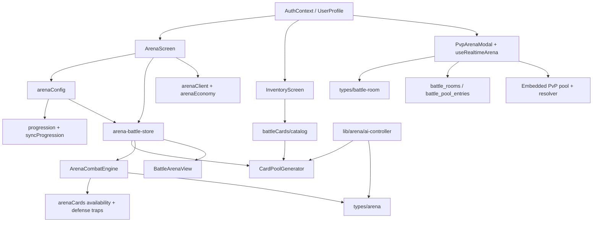
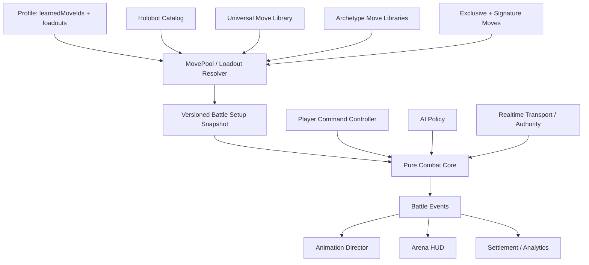

# Holobots Arena: Current Architecture Review and Move-System Proposal

Status: engineering proposal; no implementation included  
Scope: `mobile/` React Native client, including its direct profile/economy and realtime-PvP integration points  
Audience: senior mobile/gameplay engineers

> Refined implementation decision: [`arena-card-to-move-implementation-plan.md`](./arena-card-to-move-implementation-plan.md) supersedes this document where kit composition or progression differs. The approved target reserves slot 4 for a stamina/combo-gated Technique Finisher, provides a separate 100-meter Signature Finisher, gives each Holobot one non-upgradable innate Ability, and uses Sync Points for move ranks and specialization.

## Executive summary

The Arena already has a useful fast, asynchronous MMA combat core: both fighters act independently, stamina regenerates every two seconds, AI attempts an action roughly every 950 ms, attacks build combo and special meter, defense arms one-shot traps, and the match ends by HP or limits. The collectible-card layer is not fundamental to those rules. In PvE it mostly supplies an action definition, random queue position, ownership gate, and card-shaped UI.

The principal architectural problem is not cards themselves but **three overlapping definitions of combat content and two independent combat engines**:

1. `lib/battleCards/catalog.ts` is the active collectible catalog used by profile inventory and PvE hand construction.
2. `lib/arena/card-generator.ts` contains a second, older card catalog and fallback behavior.
3. `hooks/useRealtimeArena.ts` contains a third card pool and its own combat rules for PvP.
4. PvE resolves through `features/arena/combatEngine.ts`; PvP resolves inside Firestore transactions in `useRealtimeArena.ts`.
5. `lib/arena/ai-controller.ts` is a second AI implementation, while the live PvE store calls the AI embedded in `ArenaCombatEngine`.

The recommended migration is therefore an adapter-led conversion, not a rewrite:

- Rename the domain vocabulary from card/deck/hand to move/loadout/action slots.
- Preserve the PvE engine’s real-time loop, stamina, speed-scaled damage, combo, counter/defense-trap, special meter, rewards, and animation event output.
- Replace random card cycling with four stable equipped moves plus one Holobot signature action gated by the existing special meter.
- Introduce one canonical move catalog and one pure combat rules package shared by PvE, AI, and PvP.
- Convert existing owned cards into learned moves once, then remove card quantity and deck concepts from battle eligibility.
- Store learned moves and four-move loadouts per Holobot, not globally per account.

This provides Pokémon-style learning and loadout progression without introducing Pokémon-style turns.

## 1. Current system map

### 1.1 Battle flow

#### PvE Arena

1. `ArenaScreen` owns the presentation phase: `prebattle → battle → results`.
2. `ArenaPrebattleMenu` lets the player select an owned Holobot, Arena tier, payment method, and PvP entry.
3. `ArenaScreen.startTierRound` optionally charges an authoritative Arena entry, builds player/opponent fighters via `arenaConfig`, and calls the Zustand store's `startBattle`.
4. `arena-battle-store.startBattle` initializes `BattleState`, generates each fighter's card queue, and starts the real-time loop.
5. Every 180 ms the store checks whether two-second stamina regeneration or the AI's ~950 ms action cadence is due.
6. A player tap or AI selection calls `ArenaCombatEngine.resolveAction` synchronously. The store sets a short 350 ms animation lock and cycles the used card into the queue's back half.
7. The engine checks HP/turn/time limits and calculates local reward previews.
8. `ArenaScreen` observes `battleResult`, switches to results, and calls authoritative settlement. A victorious tier run can continue through three opponents.

#### Realtime PvP

1. `PvpArenaModal` invokes `useRealtimeArena` to create, join, or matchmake a Firestore room.
2. The hook builds player state and a random seven-card hand from a private `CARD_POOL`.
3. Each client independently runs heartbeat and two-second stamina-regeneration transactions.
4. Playing a card executes a Firestore transaction that validates the hand/stamina, calculates damage/defense/stat boosts, replaces the played card with a random draw, updates meters/logs, and determines the winner.
5. `PvpArenaModal` renders a separate PvP HUD and card UI.

These paths share names and broad concepts, but not types, content definitions, resolution rules, card generation, or UI components.

### 1.2 Dependency map



### 1.3 Combat engine

`features/arena/combatEngine.ts` is the actual PvE rules authority. It:

- Initializes and normalizes fighters and battle state.
- Delegates action eligibility to `arenaCards.ts`.
- Resolves strike, defense, combo, and finisher actions.
- Scales damage by attack, defense, stamina state, speed, Sync modifiers, counter bonus, combo length, and critical chance.
- Arms and consumes defense traps.
- Applies generic effects for damage, stamina, special meter, status, and combo enablement.
- Regenerates stamina and derives `fresh/working/gassed/exhausted` state.
- Selects AI actions using lethal, finisher, defense, trap-probe, combo, damage-efficiency, and stamina heuristics.
- Calculates rewards and win conditions.

Important behavior:

- Speed currently affects damage through a speed ratio; it does **not** determine action timing or priority in PvE.
- The engine is nominally turn-shaped (`turnNumber`, cooldown turns), but execution is real-time and independently initiated.
- Finishers consume full special meter and deal a hard-coded additional 2× multiplier after normal calculation.
- Action resolution uses `Math.random` directly for criticals, evasion, and AI variance, making replay/parity testing harder.

### 1.4 Card generation and templates

There are three content sources:

- `lib/battleCards/catalog.ts`: current account-owned templates (`strike.quickJab`, etc.), rarity, battle tier, random marketplace grants, and starter deck. This is what Inventory and profile bootstrap use.
- `lib/arena/card-generator.ts`: older MMA templates (`jab`, `cross`, `block`, etc.) plus queue generation/cycling and finisher surfacing. It normally instantiates the current catalog but falls back to its own templates when fewer than six valid cards are supplied.
- `hooks/useRealtimeArena.ts`: an unrelated PvP pool (`Jab`, `Cross`, `Steel Guard`, etc.) with tier-weighted random draws.

`CardPoolGenerator.generateBattleHand` does not use `ArenaFighter.archetype` despite accepting the fighter. `getArchetypeCards` exists but is not part of live generation. The configured profile deck is also not passed into PvE: `ArenaScreen` passes the full `profile.battle_cards` collection, so generation flattens owned quantities (capped at three) and shuffles up to ten. The Inventory deck editor therefore persists `arena_deck_template_ids`, but the live PvE start path ignores it.

### 1.5 Battle state

`types/arena.ts` combines four concerns in one model:

- Persistent-ish fighter identity and stats.
- Runtime mutable combat state.
- content/action definitions (`ActionCard`).
- UI/integration metadata (React Native image source, rewards preview, control flags).

The Zustand store then combines domain state, timers, animation locks, selected-card state, result state, and derived selectors. This works at the current scale, but makes deterministic simulation, PvP reuse, and persistence boundaries unclear.

Unused or weakly integrated state includes `pendingActions`, `neutralPhase`, `counterWindowOpen`, several defense timestamps/booleans, `currentActorId`, fighter `hand`, and parts of status effects. These are signs of previous turn/real-time and card-hand designs coexisting.

### 1.6 Inventory and equipment integration

`InventoryScreen` has four tabs: Holobots, Parts, Items, Cards. It:

- Builds the 12-Holobot roster and owns mint/upgrade/stat actions.
- Displays parts and consumable counts.
- Builds the card collection from `profile.battle_cards` and the template catalog.
- Edits a global 20-card `arena_deck_template_ids` array with duplicate copies limited by ownership count.

Equipment is separate from battle cards:

- `UserProfile.parts` is an untyped array of records.
- `UserProfile.equippedParts` is a deeply generic record keyed by Holobot/slot.
- `HomeScreen` is the actual part-loadout UI, and Marketplace directs users there/Inventory inconsistently.
- `buildPlayerFighter` does not read equipped parts. Equipment therefore has no direct Arena stat or move effect in the reviewed client path.

### 1.7 Holobot data and progression hooks

Holobot data is split:

- `lib/progression.ts` owns names, archetypes, base stats, level/EXP math, normalized user records, and battle-stat calculation.
- `config/holobots.ts` owns images, roster merging, chart/display stats, and a separate map of 12 special-move display names.
- `config/arenaConfig.ts` converts a `UserHolobot` into `ArenaFighter`, applies Sync modifiers/abilities, and constructs tier AI fighters.

Level, boosted attributes, Sync stats/abilities, training, fitness EXP, quests, blueprints, ranks, and authoritative Arena rewards are available progression hooks. However, none unlock combat actions. `specialMove` is display metadata only; PvE gives all charged fighters the same loaner Hyper Strike if their queue lacks a finisher, while PvP gives everyone a generic `FINISHER`.

### 1.8 Animation system

There is no authored combat-animation system in the reviewed Arena path.

- Action definitions carry `animationId`, and `BattleAction` can carry animation ID/duration.
- `BattleArenaView` renders static fighter PNGs over a battlefield and an action ticker.
- The store uses a fixed 350 ms `isAnimating` lock.
- Template animation IDs are largely generic by category and are not interpreted by the UI.
- `ActionCardHand` and `FighterDisplay` are alternate/legacy presentations not used by the current `BattleArenaView` composition.

This is an advantageous migration point: move IDs can retain animation cues without preserving card presentation.

### 1.9 Mechanics details

| Mechanic | Current behavior | Assessment |
|---|---|---|
| Stamina | 7 max; +1 every 2 seconds; move/card cost; state modifies damage | Core, preserve. Comment calling stamina “hand size” is obsolete. |
| Speed | Damage multiplier in PvE; defense probability/stat boosts in PvP | Preserve concept, unify formula and clarify whether it affects recovery/action frames. |
| Combo | Strikes increment chain; combos require chain and multiply damage; defense/finisher resets | Core, preserve; model requirements/effects declaratively. |
| Counter | Defense cards arm guard/evade/counter/reversal traps consumed by next attack | Core, preserve; rename trap to stance/reaction for MMA clarity. |
| Special meter | Damage dealt/taken and defense build meter; finisher requires 100 and consumes it | Core, preserve; signature attack should be the meter consumer. |
| AI | Live PvE heuristic inside engine; unused second AI class; unrelated PvP human rules | Retain heuristics, move to policy layer consuming generic moves. |
| Equipment | Persisted and displayed, but not applied by Arena fighter builder | Define explicit boundary; avoid letting parts grant arbitrary moves initially. |
| Progression | Levels/stats/Sync/rewards exist; no move learning | Add deterministic move-unlock projection per Holobot. |

## 2. File ownership map

### Direct Arena runtime

| File | Current responsibility | Proposed owner |
|---|---|---|
| `src/screens/ArenaScreen.tsx` | PvE phase orchestration, entry charge, run progression, settlement, modal composition | Arena application coordinator only |
| `src/components/arena/ArenaPrebattleMenu.tsx` | Tier/payment/Holobot selection and PvP launch | Arena setup UI; show equipped move summary |
| `src/components/arena/BattleArenaView.tsx` | Current PvE HUD, stage, four visible cards, action ticker | Battle presentation; four stable move controls |
| `src/components/arena/BattleResultsModal.tsx` | Result/reward presentation | Unchanged presentation |
| `src/components/arena/PvpArenaModal.tsx` | PvP matchmaking and an independent battle HUD/card UI | PvP shell using shared battle presentation primitives |
| `src/components/arena/ActionCardHand.tsx` | Alternate horizontal card-hand UI | Remove after verifying no external use |
| `src/components/arena/FighterDisplay.tsx` | Alternate fighter HUD | Reuse as primitive or remove; not current PvE screen |
| `src/stores/arena-battle-store.ts` | PvE runtime, timers, engine calls, card cycling, UI animation state | Split session controller from presentation state; retain cadence |
| `src/features/arena/combatEngine.ts` | PvE rules, AI, rewards, win checks | Canonical pure battle rules after extracting AI/rewards |
| `src/features/arena/arenaCards.ts` | Availability, defense definitions/cooldowns, utility scoring | Rename/split into move eligibility and reaction definitions |
| `src/lib/arena/card-generator.ts` | Queue instantiation, older templates, cycling, finisher loan | Replace with loadout resolver; remove random queue/catalog |
| `src/lib/arena/combat-engine.ts` | One-line compatibility re-export | Remove after imports converge |
| `src/lib/arena/ai-controller.ts` | Unused second AI policy | Remove or replace with extracted canonical AI policy |
| `src/types/arena.ts` | All PvE types | Split content, loadout, and runtime types |
| `src/config/arenaConfig.ts` | Fighter construction, tier opponent selection/rewards | Keep; inject resolved loadout/passive/signature |
| `src/lib/arenaClient.ts` | Authoritative Arena entry/settlement callable wrappers | Keep contract; extend payload version only if server validates moves |
| `src/lib/arenaEconomy.ts` | Tiers, costs, base rewards/blueprints | Keep unchanged |

### Card, profile, PvP, and progression integration

| File | Current responsibility | Proposed change |
|---|---|---|
| `src/lib/battleCards/catalog.ts` | Collectible catalog, starter grants, random pack grants | Temporary migration source; replace with canonical move catalog and conversion map |
| `src/screens/InventoryScreen.tsx` | Roster/parts/items/card collection and deck editor | Replace Cards with per-Holobot Moves/Loadout experience; split 950-line screen |
| `src/types/profile.ts` | User Holobot/profile persistence including cards/deck/equipment | Add learned moves/loadouts; deprecate card/deck fields |
| `src/contexts/AuthContext.tsx` | Profile bootstrap and starter card grant | Bootstrap starter learned moves/loadouts instead |
| `src/lib/marketplace.ts` | Random card pack rewards | Remove battle-card grants or convert product to move-training resources/cosmetics |
| `src/screens/MarketplaceScreen.tsx` | Markets packs/parts/items/cards | Remove copy promising battle cards |
| `src/hooks/useRealtimeArena.ts` | Firestore matchmaking, presence, stamina, private content and combat engine | Split transport/session from shared battle rules; highest-risk convergence work |
| `src/types/battle-room.ts` | Separate PvP battle/card/state types | Version and align with shared move/action DTOs |
| `src/lib/pvpMatchmaking.ts` | Atomic queue claim and room creation | Keep transport logic; room factory takes shared snapshot |
| `src/lib/progression.ts` | Canonical roster/base stats/archetypes/level math | Add or call move-unlock projection; keep stat math |
| `src/config/holobots.ts` | Images/roster/display stats/display-only special names | Move identity/combat definitions to Holobot catalog; retain asset helpers |
| `src/lib/syncProgression.ts` | Sync-derived combat modifiers and abilities | Keep; map abilities to typed passive modifiers |
| `src/lib/progressionSystems.ts` | Training/quest progression state | Add move-learning rewards via explicit unlock service, not UI mutation |
| `src/screens/TrainingScreen.tsx` | Training and stat progression | Optional future move-learning surface |
| `src/screens/FitnessScreen.tsx` | Workout EXP and Sync integration | No direct change; level-up can produce unlock notifications |
| `src/screens/QuestsScreen.tsx` | Quest progression | Optional move-teaching reward source |
| `src/screens/HomeScreen.tsx` | Holobot dashboard and equipment loadout | Show active move kit summary; keep equipment distinct |

### Tests

| File | Responsibility / migration |
|---|---|
| `src/features/arena/__tests__/combatEngine.test.ts` | Preserve as characterization tests; rename card fixtures to moves incrementally |
| `src/lib/arena/__tests__/card-generator.test.ts` | Replace queue/cycling tests with loadout validation and legacy conversion tests |
| `src/lib/__tests__/arenaServerParity.test.ts` | Retain economy/reward parity; add versioned battle snapshot parity if server resolves matches |
| `src/lib/__tests__/economyServerParity.test.ts` | Remove card-rarity/grant parity when marketplace cards retire |

Native iOS/Android/watch files and unrelated screens do not participate in Arena combat. The `functions/` implementation is outside the requested `mobile/` scope, but parity tests prove authoritative server dependencies exist and must be included in implementation planning.

## 3. Design evaluation

### Strengths

- The real-time cadence is simple, legible, and already supports quick MMA exchanges rather than alternating turns.
- Core mechanics are isolated enough in the PvE engine to survive a presentation/content migration.
- Action definitions already use data-driven costs, requirements, effects, and animation IDs—the shape of a move definition is mostly present.
- Defense traps create meaningful reads/counters and are more distinctive than ordinary RPG defense buffs.
- `BattleAction` history is a useful animation, replay, analytics, and reward seam.
- Holobot base stats/archetypes, Sync modifiers, level progression, and 12-character asset coverage already exist.
- Character and action identifiers are string-based, enabling backward-compatible adapters.
- Existing tests cover many subtle rules, including deadlock prevention and non-lethal finishers.

### Unnecessary complexity and confusing abstractions

- “Card,” “template,” “hand,” “deck,” “pool,” and “tray” describe random collectible mechanics, while runtime behavior is actually “choose an available action.”
- The PvE model carries turn concepts while the controller is real-time.
- Runtime state, configuration, persistence, UI images, and reward previews share one type module.
- `selectedCardId` and callbacks exist but the current battle view directly plays on tap; selection state is vestigial.
- Defense exists as booleans, timestamps, cooldown fields, armed traps, and per-template cooldown maps.
- The card generator accepts a fighter but ignores archetype in live generation.

### Duplicated systems and technical debt

- Two combat engines: PvE class versus PvP hook transaction.
- Two AI controllers: one live in `combatEngine`, one apparently unused in `lib/arena/ai-controller.ts`.
- Three action catalogs and two starter-hand algorithms.
- Two battle state schemas and two `CardType` definitions.
- Current catalog defense aliases collapse several differently named collectibles into only three defense behaviors.
- Display stats and battle stats are computed along separate paths.
- The Inventory editor writes a deck that PvE does not consume.
- Client-local `Math.random`, timers, and Firestore transactions make deterministic parity and anti-cheat difficult.
- Large screens/components (`InventoryScreen` ~950 lines, `BattleArenaView` ~770, `PvpArenaModal` ~689) mix presentation, orchestration, and domain operations.

### Where cards exist only due to prior design

The following concepts have no necessity in the desired combat:

- Multiple owned copies of the same action.
- A 20-card global deck.
- Random shuffle and cycling after each use.
- Four “visible” cards selected from a larger queue.
- Tier-weighted random draws in PvP.
- Loaning a generic finisher into the hand when the meter fills.
- Card rarity as combat eligibility.
- Card packs as the primary action-unlock economy.

The underlying useful concepts—action definition, four buttons, cost, cooldown, requirements, effect, category, animation cue—should remain as moves.

### Roster expansion blockers

- Holobot uniqueness currently stops at stats, archetype label, image, and an unused special-move string.
- Archetype card lists are dead code and use inconsistent IDs (`spinningBackfist` versus `spinning_backfist`).
- Signature behavior is generic in both PvE and PvP.
- Adding a character-specific action currently requires touching generic catalogs and potentially alias tables, UI, AI, and both engines.
- Passives are free-form strings/Sync IDs rather than typed effects.
- No validation guarantees that a Holobot’s pool contains legal starter choices or four learnable moves at a given level.

## 4. Target architecture

### 4.1 Principles

1. **Moves are content; combat rules are mechanics.** The engine consumes resolved definitions and never reads inventory/profile directly.
2. **One rules core, multiple controllers.** PvE AI and realtime PvP submit commands to the same pure reducer/resolver.
3. **Four stable equipped moves.** No draw, duplicates, shuffle, or cycling. Availability is stamina/requirements/cooldown/state only.
4. **Signature is identity, not a fifth collectible.** It is attached to the Holobot definition and becomes available at full special meter.
5. **Pools compose.** Universal + archetype + Holobot-exclusive + progression grants; no per-character engine forks.
6. **Persistence stores IDs; battle snapshots store resolved/versioned definitions.** This prevents mid-match catalog updates from changing results.
7. **Randomness is injected and seeded.** Replays/tests/servers can reproduce results.

### 4.2 Target dependency map



### 4.3 Proposed TypeScript interfaces

These are design contracts, not implementation code.

```ts
type MoveId = string;
type HolobotId = string;
type ArchetypeId = "striker" | "grappler" | "technical" | "balanced";

type MoveCategory = "strike" | "defense" | "combo" | "utility";
type MoveAccess = "universal" | "archetype" | "exclusive";

interface MoveDefinition {
  id: MoveId;
  version: number;
  name: string;
  category: MoveCategory;
  access: MoveAccess;
  archetypeIds?: ArchetypeId[];
  holobotIds?: HolobotId[];
  staminaCost: number;
  basePower: number;
  speedFactor: number;
  cooldownMs?: number;
  requirements: MoveRequirement[];
  effects: MoveEffect[];
  combo: ComboMetadata;
  reaction?: ReactionDefinition;
  animationCue: AnimationCue;
  description: string;
  tags: string[];
}

interface SignatureMoveDefinition extends Omit<MoveDefinition, "access"> {
  access: "exclusive";
  specialMeterCost: 100;
}

interface HolobotCombatDefinition {
  id: HolobotId;
  name: string;
  archetypeId: ArchetypeId;
  passiveIds: string[];
  exclusiveMoveIds: MoveId[];
  signatureMoveId: MoveId;
  learnset: MoveUnlock[];
}

interface MoveUnlock {
  moveId: MoveId;
  condition:
    | { kind: "starter" }
    | { kind: "level"; level: number }
    | { kind: "syncLevel"; level: number }
    | { kind: "training"; courseId: string }
    | { kind: "reward"; rewardId: string };
}

interface HolobotMoveProgress {
  learnedMoveIds: MoveId[];
  acknowledgedUnlockIds?: MoveId[];
}

interface MoveLoadout {
  holobotId: HolobotId;
  slotMoveIds: [MoveId, MoveId, MoveId, MoveId];
  revision: number;
}

interface PassiveDefinition {
  id: string;
  name: string;
  trigger: "battle_start" | "before_action" | "after_action" | "on_hit" | "on_damaged";
  conditions: CombatCondition[];
  effects: MoveEffect[];
}

interface BattleFighterState {
  identity: { holobotId: HolobotId; ownerUserId: string; name: string };
  stats: ResolvedCombatStats;
  resources: { hp: number; stamina: number; specialMeter: number };
  combo: { count: number; lastTag?: string };
  reaction: ArmedReaction | null;
  cooldowns: Record<MoveId, number>;
  statuses: ActiveStatus[];
  loadout: ResolvedMoveDefinition[];
  signature: ResolvedSignatureMove;
  passiveIds: string[];
}

interface BattleState {
  id: string;
  rulesVersion: number;
  contentVersion: number;
  status: "active" | "completed" | "abandoned";
  fighters: { player: BattleFighterState; opponent: BattleFighterState };
  sequence: number;
  startedAt: number;
  lastResolvedAt: number;
  events: BattleEvent[];
}

type BattleCommand =
  | { type: "use_move"; actor: "player" | "opponent"; moveId: MoveId; clientSequence: number }
  | { type: "use_signature"; actor: "player" | "opponent"; clientSequence: number }
  | { type: "regenerate_stamina"; elapsedMs: number };

interface BattleResolution {
  state: BattleState;
  emittedEvents: BattleEvent[];
}
```

Design notes:

- Signature is not one of the four slots, avoiding the choice between identity and basic tactical coverage. It appears as an empowered fifth control only when charged.
- If product insists that signature occupy one of four slots, use the same interfaces but include it in `slotMoveIds`; do not create another engine path.
- Prefer millisecond cooldowns in a genuinely real-time system. If existing defense cooldown semantics must be preserved exactly during migration, retain action-count cooldowns initially and change them only in a separately balanced release.
- Keep `animationCue` declarative (`actorMotion`, `targetReaction`, `impactFx`, `durationMs`) and let the view map cues to native animations/assets.

## 5. Scalable character architecture for 12 Holobots

### Content composition

Each Holobot definition references shared content:

```text
Effective learnset
  = universal MMA library
  + one archetype library
  + 2–4 Holobot-exclusive standard moves
  + exactly one signature attack
```

Recommended starting budget:

- Universal library: 10–14 moves covering jab/cross/body strike, guard/slip/parry, basic takedown/escape, and general combo links.
- Each archetype library: 6–8 moves emphasizing its game plan.
- Each Holobot: 2 exclusive learnable moves, 1 passive, 1 signature at launch.
- Each level band should offer choices, but every Holobot must have at least four legal learned moves at level 1.

### Archetype identities

| Archetype | Shared mechanical identity | Example move tags |
|---|---|---|
| Striker | Fast pressure, meter gain, long hit chains | `punch`, `kick`, `pressure`, `launcher` |
| Grappler | Guard breaks, stamina pressure, high commitment | `clinch`, `takedown`, `slam`, `control` |
| Technical | Reactions, counters, debuffs, efficiency | `counter`, `evade`, `precision`, `tempo` |
| Balanced | Reliable links and adaptable defense | `fundamental`, `link`, `recovery`, `stance` |

Do not encode archetypes as conditional branches in the engine. Archetypes only choose available move/passive IDs and perhaps AI weight presets.

### Passives

Passives should be small, typed modifiers through shared triggers—not bespoke callbacks per Holobot. Examples: first strike bonus, counter meter gain, reduced first stamina cost after evade, or low-HP speed bonus. Cap launch passives at one per Holobot and avoid passives that alter the game loop/timer.

### Signature attacks

Map the existing 12 names to real signature definitions:

| Holobot | Signature seed |
|---|---|
| ACE | 1st Strike |
| KUMA | Sharp Claws |
| SHADOW | Shadow Strike |
| ERA | Time Warp |
| HARE | Counter Claw |
| TORA | Stalk |
| WAKE | Torrent |
| GAMA | Heavy Leap |
| KEN | Blade Storm |
| KURAI | Dark Veil |
| TSUIN | Twin Strike |
| WOLF | Lunar Howl |

Each uses the same signature resolution pipeline. Uniqueness comes from data-driven effects, tags, reactions, and animation cues. Avoid one class or switch branch per Holobot.

## 6. Migration plan

### What stays exactly the same initially

- Real-time player input and independent AI cadence.
- Two-second, +1 stamina regeneration; max stamina 7.
- Current stamina costs and stamina-state thresholds/modifiers.
- Current PvE damage/stat scaling, including speed contribution, until a dedicated balance pass.
- Combo counter and combo requirements/multipliers.
- Defense trap/reaction behaviors and cooldown values.
- Special meter build/100 cap/consumption.
- Battle action history, win checks, tier runs, entry charging, rewards, and settlement.
- Holobot base stats, levels, Sync modifiers, images, and existing progression sources.

“Exactly” here means behaviorally characterized by tests before vocabulary changes.

### Rename

| Current | Target |
|---|---|
| `ActionCard` | `MoveDefinition` / `ResolvedMove` |
| `CardType` | `MoveCategory` |
| `CardRequirement` | `MoveRequirement` |
| `CardEffect` | `MoveEffect` |
| `CardPoolGenerator` | `MoveLoadoutResolver` |
| `playerCards/opponentCards` | `playerMoves/opponentMoves` |
| `playCard/canPlayCard` | `useMove/canUseMove` |
| `arenaCards.ts` | `moveEligibility.ts` + `reactions.ts` |
| `armedDefenseTrap` | `armedReaction` or `activeDefenseStance` |
| `cardCooldowns` | `moveCooldowns` |
| Cards tab | Moves / Loadout |

Keep compatibility aliases for one release to reduce the blast radius.

### Remove

- Card rarity and owned-copy requirements from combat.
- Global 20-card deck and duplicate slots.
- Queue shuffle/cycling and four-of-ten visibility.
- Generic bonus-finisher injection.
- Old templates in `card-generator.ts` after conversion.
- Unused `ArenaAI` implementation after canonical AI extraction.
- Alternate card UI and compatibility re-export after call sites converge.
- PvP private action pool/resolution once shared rules are authoritative.

### Data model changes

Add per-Holobot learned moves and loadouts. Prefer nesting on each `UserHolobot` because progression belongs to the character:

```ts
UserHolobot {
  learnedMoveIds?: string[];
  moveLoadout?: [string, string, string, string];
  moveProgressionVersion?: number;
}
```

Retain `battle_cards` and `arena_deck_template_ids` as deprecated read-only migration inputs for at least one release. Do not dual-write indefinitely.

### Existing-card conversion

1. Freeze a versioned `legacyCardId → moveId` table.
2. Convert every distinct owned card ID into one learned move; quantities collapse to ownership.
3. Map functional aliases to the same canonical move where their current behavior is identical. Preserve cosmetic provenance separately only if commerce requires it.
4. Build the initial four-move loadout from the saved deck order, taking the first four distinct, legal converted moves.
5. Fill missing slots with universal starter moves appropriate to the Holobot.
6. Apply the conversion to every owned Holobot, because the current cards are account-global. Later unlocks are per Holobot.
7. Record `moveProgressionVersion` so conversion is idempotent.
8. Decide compensation for duplicate card copies before launch; recommended: convert extras into a non-combat training currency/cosmetic credit, not move power.

### Move pools and learning

- Resolve eligibility from Holobot identity + archetype + unlock conditions.
- Starter moves are learned on acquisition/mint.
- On level/Sync/training/reward changes, a pure projection identifies newly satisfied unlocks.
- Authoritative profile mutation grants IDs once; UI only announces them.
- Never infer “learned” dynamically from current level alone if respec/prestige behavior may change; persist grants.
- Signature is attached automatically to the Holobot and never occupies inventory.

### AI adaptation

Preserve the existing selection priorities but evaluate four stable moves plus signature:

1. Legal lethal move.
2. Signature when charged and tactically worthwhile.
3. Defense/reaction under HP/stamina pressure.
4. Cheap probe into an armed reaction.
5. Combo continuation.
6. Score by expected damage, stamina efficiency, speed, reaction risk, meter value, and personality.

Add archetype/personality weights as data. Remove template-ID checks (`parry`, `roll`, `slip`) in favor of tags/effects. Seed tie-breaking randomness.

### Inventory changes

- Rename Cards tab to `Moves`; scope it to the selected Holobot.
- Remove owned quantity, rarity filters, equipped-copy counts, and 20-card deck panel.
- Show exactly four numbered loadout slots plus a separate locked/fixed signature row.
- Library filters: All, Universal, Archetype, Exclusive, Learned/Locked; default to learned and compatible.
- Parts remain inventory/equipment and should not grant moves in phase one. If parts affect combat later, expose typed stat/passive modifiers through fighter construction.

### Progression unlocks

Recommended launch curve:

- Level 1: 4 universal/archetype starters.
- Levels 3/5/8/12: additional universal or archetype moves.
- Sync milestones: one technique emphasizing the Holobot’s passive/playstyle.
- Character-exclusive moves: level or character mastery gates.
- Signature: always known, meter-gated in battle; optional later signature upgrades change presentation or bounded tuning, not ownership.

Prestige must not delete learned moves. Training can accelerate or teach optional moves, but basic four-move viability must never depend on random drops.

## 7. UI recommendations

### Arena

- Replace four card-shaped panels with four compact move buttons in a 2×2 or single-row adaptive action dock. Keep category color as a thin accent, not the dominant surface.
- Each button shows name, stamina cost, and one state indicator (cooldown/requirement). Put detailed description behind long press or prebattle inspection.
- Show signature as one distinct meter-integrated control, hidden or subdued until near-ready, then prominent at 100.
- Remove the card-type legend; direct labels/icons are sufficient.
- Keep HP, stamina, combo, and special in the HUD, but reduce duplicate text values and decorative frames.
- Surface reaction stance next to the fighter rather than in instructional deck copy.
- Drive visual sequences from emitted battle events. Do not use one global 350 ms duration once authored animation arrives.
- Reuse the same battle-stage and move controls for PvP; transport status can be an overlay.

### Inventory / Move Loadout

- First select a Holobot; the screen header should communicate portrait, archetype, passive, and signature.
- Make the four slots the primary content. The move library is secondary below it or in a sheet.
- Selecting a slot filters the library to legal replacements; one tap previews, explicit Equip confirms.
- Compare replacement versus equipped move using only cost, power, speed, and tactical tags.
- Locked moves show the exact unlock condition, not rarity.
- Keep equipment in a separate `Parts` subview and items in `Items`; do not combine move and physical inventory semantics.
- Split the current `InventoryScreen` into roster selection, Holobot summary, move loadout, parts, and items components. Domain mutations go through profile/application services, not inline view functions.

Uniqueness should come from portrait, passive/signature copy, exclusive move animation/accent, and archetype recommendations—not twelve distinct screen layouts.

## 8. Recommended folder structure

```text
src/features/arena/
  application/
    arenaSessionController.ts
    buildBattleSetup.ts
    settleBattle.ts
  combat/
    combatEngine.ts
    damage.ts
    eligibility.ts
    reactions.ts
    resources.ts
    winConditions.ts
    battleEvents.ts
    types.ts
  ai/
    aiPolicy.ts
    personalities.ts
  content/
    moves/
      universal.ts
      archetypes/
        striker.ts
        grappler.ts
        technical.ts
        balanced.ts
      exclusive.ts
      signatures.ts
      catalog.ts
    holobots/
      catalog.ts
      passives.ts
    contentVersion.ts
  loadout/
    movePoolResolver.ts
    loadoutValidator.ts
    legacyCardMigration.ts
    types.ts
  pvp/
    realtimeArenaTransport.ts
    battleRoomCodec.ts
  presentation/
    ArenaScreen.tsx
    ArenaPrebattleMenu.tsx
    BattleArenaView.tsx
    BattleHud.tsx
    MoveActionDock.tsx
    SignatureControl.tsx
    BattleResultsModal.tsx
    PvpArenaModal.tsx

src/features/inventory/
  InventoryScreen.tsx
  MoveLoadoutPanel.tsx
  MoveLibrary.tsx
  HolobotInventoryHeader.tsx
  PartsPanel.tsx
  ItemsPanel.tsx
```

The exact folder move should follow behavior migration, not precede it. Avoid a large path-only refactor in the same release as PvP convergence.

## 9. Phased implementation roadmap

### Phase 0 — Characterize and decide (3–5 engineer-days)

- Freeze PvE behavior with tests for stamina cadence, speed scaling, combo, reactions, meter, AI priorities, win/reward rules.
- Add PvP characterization tests around current transaction math.
- Decide signature-as-fifth-control versus signature-in-four; recommendation is fifth meter-gated control.
- Decide duplicate-card compensation and server authority strategy.

Exit: approved rules matrix and legacy conversion policy.

### Phase 1 — Introduce move vocabulary behind adapters (5–8 days)

- Add move/loadout types and canonical catalog generated initially from existing active templates.
- Add card-to-move compatibility adapters.
- Replace generator output with exactly four resolved moves in an opt-in feature flag while leaving engine behavior unchanged.
- Rename store-facing methods through aliases.

Exit: PvE can run with stable four moves and unchanged combat outcomes.

### Phase 2 — Profile migration and loadout UI (7–12 days)

- Add versioned profile fields and idempotent legacy conversion.
- Build per-Holobot four-slot editor and unlock display.
- Update bootstrap, Marketplace copy/rewards, and profile validation.
- Add analytics for conversion, invalid loadouts, and move use.

Exit: users can learn/equip moves; card UI is no longer needed for PvE.

### Phase 3 — Character content architecture (7–12 days, content dependent)

- Define 12 Holobot records, four archetype libraries, passives, exclusive moves, and signatures.
- Validate all level-1 loadouts and every learnset automatically.
- Adapt AI scoring to tags and stable four-move kits.
- Add signature battle events and presentation.

Exit: all 12 characters are mechanically identifiable without custom engines.

### Phase 4 — PvP convergence (10–18 days)

- Extract transport/presence/matchmaking from `useRealtimeArena`.
- Version battle snapshots/commands and move PvP resolution to a trusted shared/server rules package.
- Replace random hands with submitted validated loadouts.
- Reuse the Arena HUD/action dock and test reconnect/idempotency/race cases.

Exit: PvE and PvP consume the same content and rules version.

### Phase 5 — Cleanup and authored animation (5–10 days plus art)

- Remove deprecated catalogs, card fields after telemetry confirms migration, duplicate AI, dead components, and compatibility exports.
- Split large views and add event-driven animation director.
- Remove card products or complete their replacement economy.

Estimated engineering total: **37–65 engineer-days**, excluding final balance, animation asset production, backend deployment lead time, and economy/customer-support work. A two-engineer team should plan roughly 5–8 calendar weeks with staged releases; PvP authority and content production are the main variance.

## 10. Risks and mitigations

| Risk | Impact | Mitigation |
|---|---|---|
| PvE/PvP divergence persists | Balance exploits and duplicated work | Treat shared rules/versioned snapshots as Phase 4 exit criterion, not optional cleanup |
| Legacy buyers lose perceived value | Economy/support issue | Publish deterministic conversion; compensate duplicates; preserve cosmetic provenance if needed |
| Four stable moves reduce tactical variety | Combat feels repetitive | Design meaningful cooldown/reaction/combo interactions; broaden prebattle choices, not in-battle randomness |
| Signature fifth control increases UI density | Arena clutter | Integrate it into special meter and reveal progressively |
| Client-authoritative randomness/timers | Cheating and desync | Seed randomness; resolve PvP on trusted authority with idempotent commands |
| Balance changes hide inside migration | Hard-to-diagnose regressions | Preserve formulas first; balance in later versioned content updates |
| Profile partial migration | Invalid/empty kits | Idempotent version, fallback starter kit, server validation, telemetry |
| Equipment accidentally compounds power | Meta becomes opaque | Keep moves independent of parts initially; typed bounded modifiers later |
| Catalog updates break active matches | Replay/desync | Snapshot resolved versioned moves at match start |
| Large UI refactors delay mechanics | Delivery risk | Build adapters and loadout behavior first; move files/split views incrementally |

## 11. Acceptance criteria for the target system

- Every owned Holobot has a valid four-move loadout and one signature.
- Every move is sourced from exactly one canonical catalog.
- Move eligibility depends on learned status and Holobot compatibility, never duplicate quantity.
- PvE and PvP use the same move definitions and combat formulas/version.
- Stamina, speed, combo, counter/reaction, and special-meter characterization tests retain approved behavior.
- Adding a 13th Holobot requires a catalog record, learnset/passive/signature references, and assets—no engine branch.
- AI selects actions by effects/tags, not hard-coded move IDs.
- Inventory no longer presents a global collectible battle-card deck.
- Active matches are reproducible from setup snapshot, command stream, content/rules versions, and RNG seed.

## Final recommendation

Proceed with an **incremental domain rename plus rules convergence**, not a new battle engine. The PvE engine is the best base because it already expresses the desired MMA systems and has characterization tests. First remove random hand semantics behind an adapter, then migrate profile/loadout data, then add composed Holobot move pools and signatures. Converge PvP before investing heavily in balance or animation; otherwise every new move will double implementation and testing cost.
